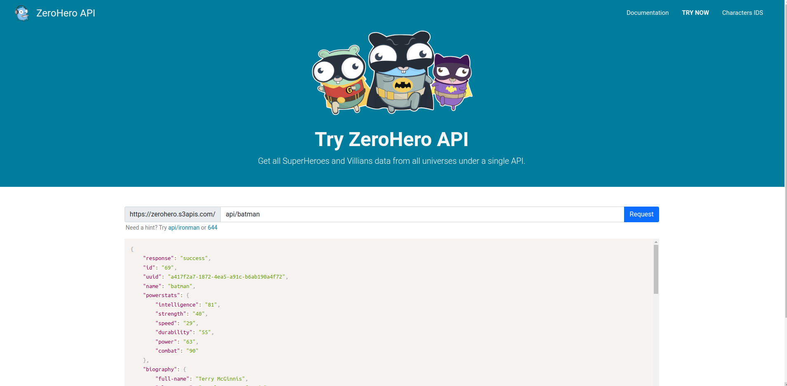

# zerohero web

É um projeto que fizemos para brincar em um bootcamp Hands-on ao vivo.
você irá encontrar o fonte do projeto em:
[github zerohero](https://github.com/jeffotoni/gzerohero)

Usamos a base e referência do [Superhero API](https://superheroapi.com/index.html).

Usamos 

